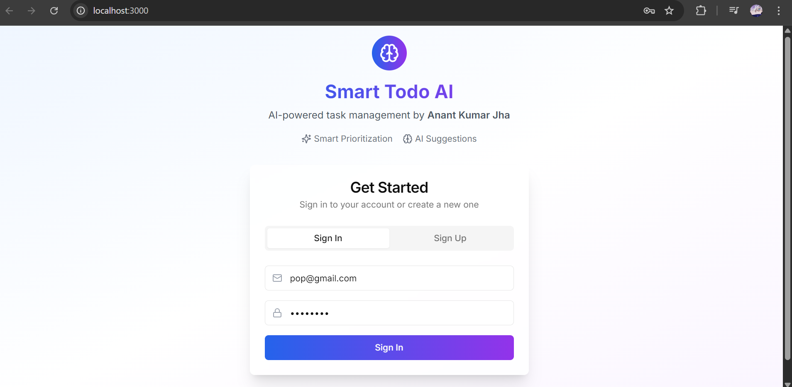
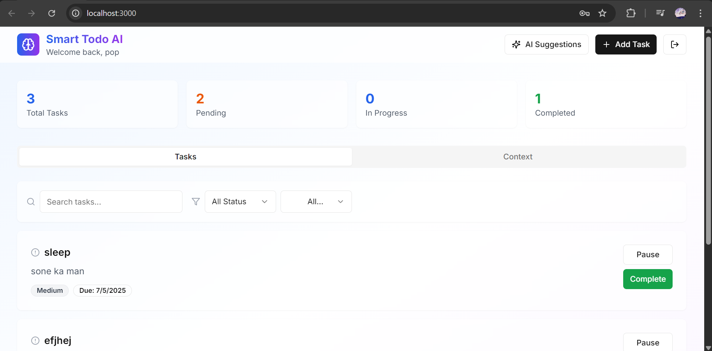
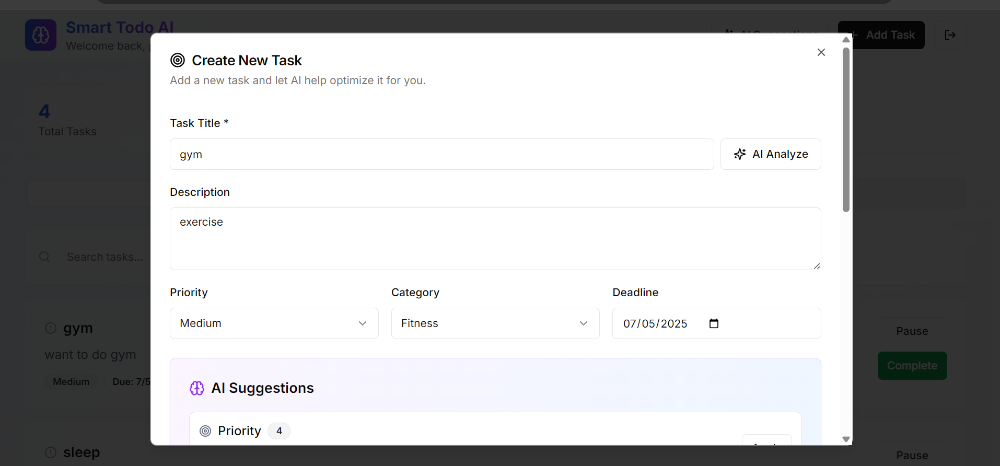
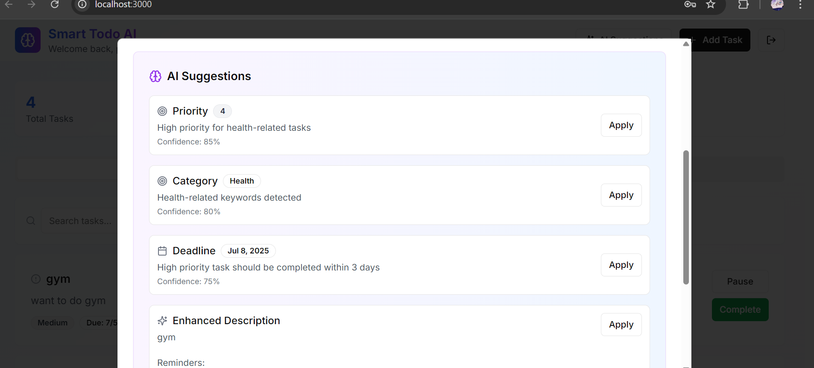
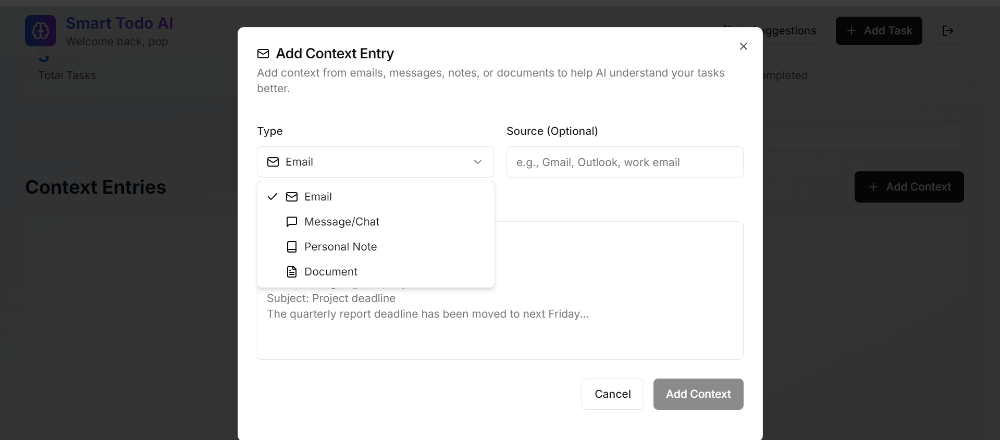

# 🧠 Smart Todo AI

AI-powered task management that thinks ahead.  
Built with **Django REST + Next.js + Supabase + LM Studio / OpenAI**.

---

## 📸 Screenshots

**Sign In / Sign Up page**  

**Dashboard showing task list with priority**  

**Task creation/edit form with AI suggestions**  
  

**Context input screen (messages, emails, notes)**  

---

## 🚀 Features

- 🔁 Full-stack Todo manager with AI integration
- 🧠 AI Suggestions:
  - Task prioritization
  - Deadline recommendations
  - Context-based task enhancement
  - Smart categorization (auto tags)
- 📥 Daily context analysis (Emails, Notes, WhatsApp-style input)

---

## 🧱 Tech Stack

| Layer     | Technology                          |
|-----------|--------------------------------------|
| Frontend  | Next.js + Tailwind CSS               |
| Backend   | Django REST Framework                |
| AI Module | OpenAI / LM Studio (LLaMA / Mistral) |
| Database  | Supabase (PostgreSQL)                |
| Storage   | Supabase Storage                     |

---

## 📂 Folder Structure

/project  
┣ backend/ # Django backend  
┣ frontend/ # Next.js frontend  
┃ ┣ app/  
┃ ┣ components/  
┃ ┣ hooks/  
┃ ┣ lib/  
┃ ┣ ...  
┣ supabase/ # DB config, migrations  
┗ README.md  

---

## ⚙️ Setup Instructions

### 🛠 Backend Setup (Django)
cd project/backend
python -m venv env
source env/bin/activate  # or env\Scripts\activate on Windows
pip install -r requirements.txt
python manage.py migrate
python manage.py runserver

🌐 Frontend Setup (Next.js)
cd project/frontend
npm install
npm run dev

🤖 AI Integration (LM Studio)
This project uses LM Studio to run local LLMs (like LLaMA 2 Chat, Mistral, etc.) for:

Task analysis

Priority scoring

Deadline prediction

Smart tagging and enhanced descriptions

LM Studio is used as a drop-in replacement for OpenAI, using this endpoint:  
LLM_API_URL=http://192.168.xx.xx:1234/v1/chat/completions

✅ Uses OpenAI-style prompt format: messages[] with role + content  
✅ Compatible models: llama-2-7b-chat, mistral-instruct, openchat, etc.

📡 API Documentation  
GET APIs
| Endpoint          | Description               |
| ----------------- | ------------------------- |
| `/api/tasks`      | Get all tasks             |
| `/api/categories` | Get task categories/tags  |
| `/api/context`    | Get daily context entries |

POST APIs

| Endpoint          | Description                       |
| ----------------- | --------------------------------- |
| `/api/tasks`      | Create new task                   |
| `/api/context`    | Add context entry (email/message) |
| `/api/ai/suggest` | Get AI suggestions/prioritization |

🧪 Sample Data
supabase/sample_context.sql — Sample context entries  

backend/smarttodo/tests/fixtures/ — AI-ready task fixtures

✅ Requirements
Make sure this is in your requirements.txt:
Django==4.2.5
djangorestframework

👨‍🎓 Author  
👨‍💻 Anant Kumar Jha  
🆔 B.Tech IT, 2026  
🏫 GGSIPU (GTBIT – Guru Tegh Bahadur Institute of Technology)  
📧 jhasonu136@gmail.com  
